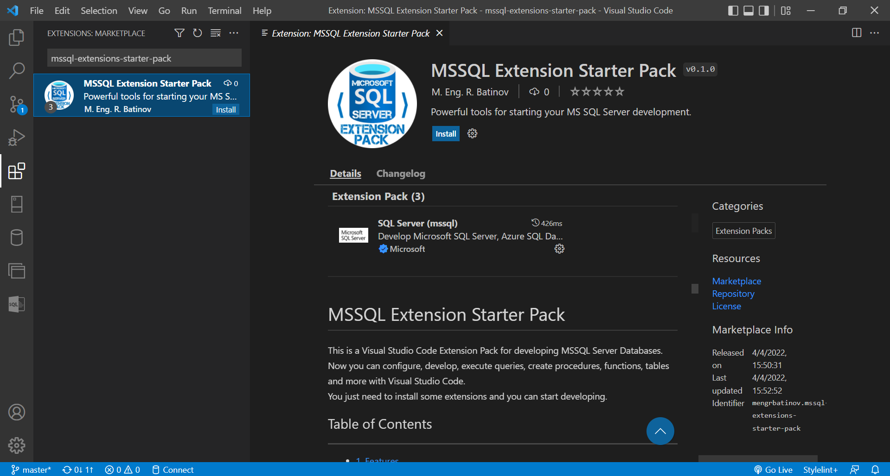

# MSSQL Extension Starter Pack 

This is a Visual Studio Code Extension Pack for developing MSSQL Server Databases.  
Now you can configure, develop, execute queries, create procedures, functions, tables and more with Visual Studio Code.   
You just need to install some extensions and you can start developing.

## Table of Contents
***
- [1. Features](#features) 
- [2. Requirements](#requirements)
- [3. How to use](#how-to-use)
- [4. Known Issues](#known-issues)
- [5. Release Notes](#release-notes)
- [6. License](#license)

## Features
***  
The Extension Pack includes all these extensions:

| # | Extension Name              | Short Description | VS Code Marketplace Link                                                        |
|---|-----------------------------|:-----------------:|---------------------------------------------------------------------------------|
| 1 | **SQL Server (mssql)**          | Develop Microsoft SQL Server, Azure SQL Database and SQL Data Warehouse everywhere                  | https://marketplace.visualstudio.com/items?itemName=ms-mssql.mssql              |
| 2 | **MSSQL Snippets**              | A lot of useful Microsoft SQL Server Snippets for writing your queries faster.                  | https://marketplace.visualstudio.com/items?itemName=MEngRBatinov.mssql-snippets |
| 3 | **MSSQL Scripts and Utilities** | MSSQL administration, definition and data modification scripts to ease your coding. Automate tasks. Execute your query faster.                  | https://marketplace.visualstudio.com/items?itemName=MEngRBatinov.mssql-scripts  |

1. ## [SQL Server (mssql)](https://marketplace.visualstudio.com/items?itemName=ms-mssql.mssql) is the official Microsoft extension for MSSQL Server. It helps you for:
    - Connecting to your server.
    - View objects (`Server`, `Databases`, `Tables`, `Views`, `Procedures`, `Functions`, `etc.`) in beautiful object explorer.
    - Write and Execute queries.
2. ## [MSSQL Snippets](https://marketplace.visualstudio.com/items?itemName=MEngRBatinov.mssql-snippets) is an extension that has a lot of useful MSSQL snippets. You can write your code faster just with writing some minimal letters or phrases. The extension provides all these snippets:
    - ### **DATA MODIFICATION**
        - `SELECT`, `SELECT WITH WHERE CLAUSE`, `SELECT WITH EXISTS/NOT EXISTS`, `SELECT WITH IN/NOT IN`, 
        - `CTEs`, `RECURSIVE CTEs`
        - `INSERT INTO`, `INSERT WITH SELECT`, `INSERT EXEC`, `SELECT INTO`
        - `UPDATE`, `UPDATE WITH JOIN`
        - `DELETE`, `DELETE TOP(N)`, `TRUNCATE`
        - `MERGING DATA`
        - `INSERT WITH OUTPUT`, `UPDATE WITH OUTPUT`, `DELETE WITH OUTPUT`, `MERGE WITH OUTPUT`
        - `UNION`, `INTERSECT`, `EXCEPT`
        - `OFFSET-FETCH`
        - ALL types of JOINS - `INNER JOIN`, `LEFT OUTER JOIN`, `RIGHT OUTER JOIN`, `FULL OUTER JOIN`, `CROSS JOIN`
        - `CROSS APPLY` and `OUTER APPLY`
        - `PIVOT` and `UNPIVOT` data
        - ##### **CONDITIONS LOGIC**
            - `IF`, `IF-ELSE`, `IF EXISTS`, `IF NOT EXISTS`, `CASE`

    - ### **DATA DEFINITION**
        - ### **DECLARATIONS OF ALL DATA TYPE VARIABLES**
            - DECLARE `INT`, `BIGINT`, `SMALLINT`, `TINYINT`, `MONEY`, `SMALLMONEY`, `DECIMAL`, `FLOAT`, `REAL`, `BIT`, `DATE`, `DATETIME`, `SMALLDATETIME`, `DATETIMEOFFSET`, `TIME`, `CHAR`, `VARCHAR`, `NVARCHAR`, `BINARY`, `VARBINARY`, `SQL_VARIANT`, `XML`, `UNIQUEIDENTIFIER`, `GEOGRAPHY`, `GEOMETRY`, `TABLE`
        - ### **CREATE**, **ALTER** and **DROP**
            - `TABLES`, `VIEWS`, `INLINE FUNCTIONS`, `SCALAR FUNCTIONS`, `MULTISTATEMENT TABLE-VALUED FUNCTIONS`, `PROCEDURES`, `CLUSTERED INDEXES`, `NON-CLUSTERED INDEXES`, `PRIMARY KEYS`, `FOREIGN KEYS`, `CONSTRAINTS`

    - ### **ALL MS SQL Server Built-in FUNCTIONS**
        - ### **Conversion FUNCTIONS**
            - `CAST`, `TRY_CAST`, `CONVERT`, `TRY_CONVERT`, `PARSE`, `TRY_PARSE`
        - ### **Date and Time FUNCTIONS**
            - `DATEPART`, `DATENAME`, `DAY`, `MONTH`, `YEAR`, `DATEFROMPARTS`, `DATETIMEFROMPARTS`, `DATETIME2FROMPARTS`, `DATETIMEOFFSETFROMPARTS`, `SMALLDATETIMEFROMPARTS`, `TIMEFROMPARTS`, `DATEDIFF`, `DATEDIFF_BIG`, `DATEADD`, `EOMONTH`, `SWITCHOFFSET`, `TODATETIMEOFFSET`, `ISDATE`
        - ### **Data FUNCTIONS**
            - `DATALENGTH`
        - ### **String FUNCTIONS**
            - `ASCII`, `CHAR`, `CHARINDEX`, `CONCAT`, `CONCAT_WS`, `DIFFERENCE`, `FORMAT`, `LEFT`, `LEN`, `LOWER`, `LTRIM`, `NCHAR`, `PATINDEX`, `QUOTENAME`, `REPLACE`, `REPLICATE`, `REVERSE`, `RIGHT`, `RTRIM`, `SOUNDEX`, `SPACE`, `STR`, `STRING_AGG`, `STRING_ESCAPE`, `STRING_SPLIT`, `STUFF`, `SUBSTRING`, `TRANSLATE`, `TRIM`, `UNICODE`, `UPPER`
        - ### **Conditions FUNCTIONS**
            - `IIF`, `CHOOSE`
        - ### **Mathematical FUNCTIONS**
            - `ABS`, `ACOS`, `ASIN`, `ATAN`, `ATN2`, `CEILING`, `COS`, `COT`, `DEGREES`, `EXP`, `FLOOR`, `LOG`, `LOG10`, `POWER`, `RADIANS`, `RAND`, `ROUND`, `SIGN`, `SIN`, `SQRT`, `SQUARE`, `TAN`
        - ### **JSON FUNCTIONS**
            - `ISJSON`, `JSON_VALUE`, `JSON_QUERY`, `JSON_MODIFY`
        - ### **Aggregate FUNCTIONS**
            - `APPROX_COUNT_DISTINCT`, `AVG`, `CHECKSUM_AGG`, `COUNT`, `COUNT_BIG`, `GROUPING`, `GROUPING_ID`, `MAX`, `MIN`, `STDEV`, `STDEVP`, `SUM`, `VAR`, `VARP`
    - ### **OTHER USEFUL SCRIPTS**
        - `RANDOM NUMBER`, `BLOCK OF COMMENTS`, `LINE OF COMMENTS`, `GET CURRENT DATE`, `GET CURRENT DATETIME`, `GET UNIX TIMESTAMP`, `TRY-CATCH`, `INSERT DELAY`, `BEGIN TRANSACTION`, `EXECUTE DYNAMIC SQL`
3. ## [MSSQL Scripts and Utilities](https://marketplace.visualstudio.com/items?itemName=MEngRBatinov.mssql-scripts) is an extension that has a lot of predefined scripts that can be directly executed based on the selected object. The extension includes all these scripts:
    - ### Server Level
        - Properties
        - Server Version
        - System Info
        - Free cache plan
        - [Helper Procedures](#helper-procedures)
        - [Utilities](#utilities)
        - [SQL Server Monitoring](#sql-server-monitoring)
        - [Database Mail](#database-mail)
    - ### Database Level
        - CREATE new Table
        - DESIGN new Table
        - Free cache plan
        - Properties
        - Query Statistics
        - Query to HTML Table
        - Query sys.objects for the selected Database
        - Search in selected Database
        - Tasks
            - BackUp/Restore Database
            - Online/Offline
            - Select tables info
            - Shrink Database
            - Shrink File
        - [Helper Procedures](#helper-procedures)
        - [Utilities](#utilities)
        - [SQL Server Monitoring](#sql-server-monitoring)
    - ### Tables Level
        - CREATE new Table
        - DESIGN new Table
        - Drop Table
        - Properties
        - Table Result to HTML Table
        - Query Statistics
        - Script As
            - INSERT
            - UPDATE
            - DELETE
            - TRUNCATE
        - SELECT 
            - COUNT(*)
            - TOP N rows
        - Columns
            - ADD, ALTER, DROP column
            - SELECT column names
            - Column names info
        - [Helper Procedures](#helper-procedures)
        - [Utilities](#utilities)
        - [SQL Server Monitoring](#sql-server-monitoring)
    - ### Views Level
        - DROP View
        - [Helper Procedures](#helper-procedures)
        - [Utilities](#utilities)
        - [SQL Server Monitoring](#sql-server-monitoring)
    - ### Stored Procedures Level
        - DROP Procedure
        - [Helper Procedures](#helper-procedures)
        - [Utilities](#utilities)
        - [SQL Server Monitoring](#sql-server-monitoring)
    - ### Functions Level
        - DROP Function
        - [Helper Procedures](#helper-procedures)
        - [Utilities](#utilities)
        - [SQL Server Monitoring](#sql-server-monitoring)
    - ### Helper Procedures
        - Database Physical Paths
        - All Active Queries
        - Template for sending e-mail
        - All Databases Info
        - All Data Types Info
        - Object Dependencies
        - Foreign Key Info
        - Primary Key Info
        - sp_help `Table`
        - Server Info
        - Statistics
        - Table Permissions
        - sp_who
        - sp_who2
        - System Full Info
        - List file and folders
        - Current Server Name
    - ### Utilities
        - All User-Created Statistics
        - Average Size of Rows in all Database Tables
        - Average Size of Rows in SELECTED Tables
        - Fragmentation Info in All Tables
        - List All Assemblies in Database
        - List Database Object with Space Info
        - List Database with Size Info
        - Recompile all Programmable Objects
        - Refresh all Views in Database
        - Server Roles and Permissions in Database
        - Tables that don't have Primary Key
        - Tables with Identity Columns
        - Tables with INSTEAD OF triggers
        - Tables with more than N Columns
        - Tables with more than N Indexes
        - Tables with N Triggers
        - Tables with number of rows
        - Tables with XML Columns
        - Tables without clustered index
        - TOP 50 unused indexes 
    - ### SQL Server Monitoring
        - Active Running Queries
        - Currently Active Sessions
        - All Databases Information
        - All Objects in Database Statistics
        - Average Read/Write Time per Database
        - BackUp Check
        - Blocking Sessions and Queries
        - Index Maintenance Scripts
        - Index Usage Statistics
        - IO Waits at Database Level
        - IO Waits at File Level
        - Last-run Queries
        - Wait Events
    - ### Performance Tuning
        - All Database Statistics
        - All Database CPU Resource Usage
        - TOP N CPU Queries in Database
        - TOP N IO Queries in Database
    - ### Database Mail
        - All Items
        - Sent Items
        - Event Log
        - Failed Items
        - Template for sending HTML E-mail

## Requirements
*** 

- You need to have `VS Code Installed`.
- Also you need to install this Extension Pack.

## How to use
***  

1. Install the extension: 
    - from [Marketplace](https://marketplace.visualstudio.com/items?itemName=MEngRBatinov.mssql-extensions-starter-pack&ssr=false#overview).  
     
    - from VS Code
        1. Open VS Code.
        2. Select `Extensions` from left panel or press `Ctrl + Shift + X`.
        3. Type in `mssql-extensions-starter-pack`. The extension with name `MSSQL Extension Starter Pack` will show.   
          
        4. You can select the extension and read the overview features if you want.  
         
        5. Pres `Install` button and you are ready.
        6. By installing `MSSQL Extension Starter Pack` ALL these extensions will be installed: 
            - [SQL Server (mssql)](https://marketplace.visualstudio.com/items?itemName=ms-mssql.mssql)
            - [MSSQL Snippets](https://marketplace.visualstudio.com/items?itemName=MEngRBatinov.mssql-snippets)
            - [MSSQL Scripts and Utilities](https://marketplace.visualstudio.com/items?itemName=MEngRBatinov.mssql-scripts)
2. Restart of VS Code may be needed.  
3. After installation you are ready to use it.
4. First you need to configure your MSSQL Connection. You can read more about how in the [MSSQL Extension Documentation](https://github.com/microsoft/vscode-mssql/wiki/manage-connection-profiles)
5. When you connect to your MSSQL Server object explorer view with your databases information, tables, views, etc. will be shown.
    - Right-click on your server, table, view, procedures, functions and all of the context menu commands will show.
    - Just click on your selected command and a script will be loaded.
    - There are 2 options for executing:
        - `If script does not need any user information to write down` - it will ask for a valid connection and after selecting one it will be directly executed.
        - `If script does need any user information to write down` - placeholders will show what you need to write down and then you can just execute the script.
6. Note that all objects are dynamically filled in the script based on your object click. So there is no need to type object information when executing the script. 
7. To use the snippets just open `.sql` file and start typing some of the prefixes and the snippets will be loaded in context menu. You can select one of them or if you know the exact prefix you can type it and hit `TAB button` and the snippet will be inserted in your document. 
    - All available snippets can be seen in the [MSSQL Snippets Documentation](https://marketplace.visualstudio.com/items?itemName=MEngRBatinov.mssql-snippets#all-available-snippets-and-their-prefixes)

## Known Issues

Currently there are no known issues.

## Release Notes

### 0.2.0

Update Documentation 

### 0.1.0

First release of extension
    
## License

[MIT](LICENSE.txt)

**Enjoy!**,  
**[M. Eng. R. Batinov](https://radoslav-batinov.bss.design/)**

